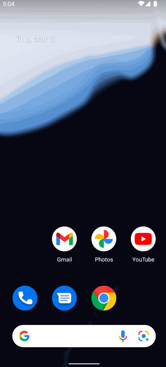

# FetchRewardsExercise
Coding Exercise for Android Internship Position 

## Solution 1 

- This is a simple solution where all the logic rests in the MainActivity and views are implemented using RecyclerView.
- Used Retrofit for network call and Gson for parsing Json Array to Object Arraylist.

### App Walkthough GIF

 

### Notes

Started with Moshi but it parses Json Array as generic List. Tried to workaround using custom adapters but to no avail. Swtiched to Gson then.

## Open-source libraries used
- [Retrofit](https://github.com/square/retrofit) - A type-safe HTTP client for Android and the JVM
- [Gson](https://github.com/google/gson) - A Java serialization/deserialization library to convert Java Objects into JSON and back
